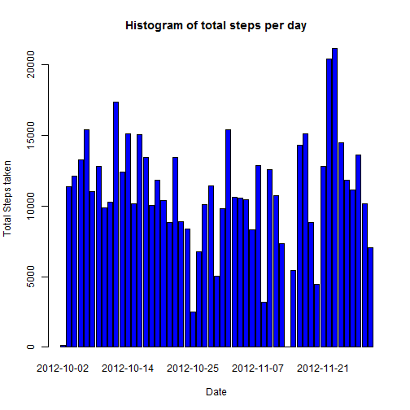
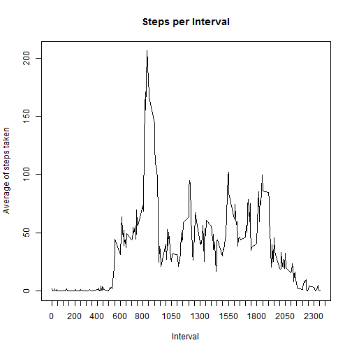
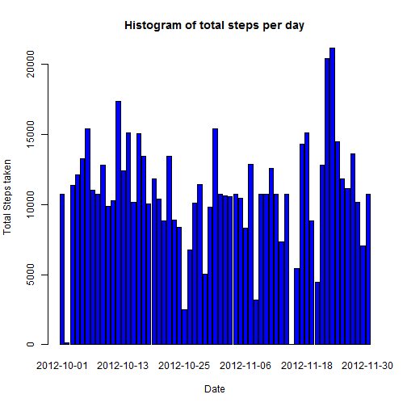
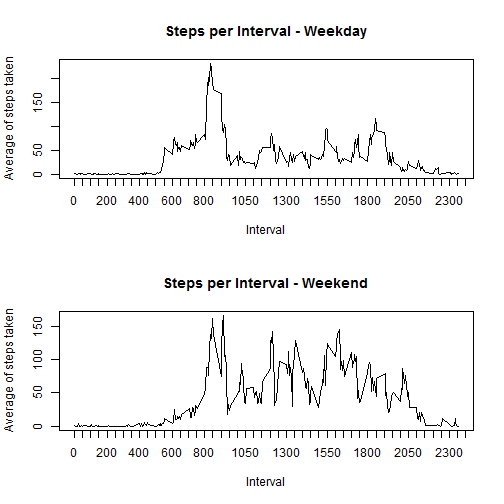

 # Reproducible Research: Peer Assessment 1
========================================================

This assignment makes use of data from a personal activity monitoring device. This device collects data at 5 minute intervals through out the day. The data consists of two months of data from an anonymous individual collected during the months of October and November, 2012 and include the number of steps taken in 5 minute intervals each day.
  
## Loading and preprocessing the data

The following steps are taken:

1. The data file is downloaded from the given source if it is not present.
2. It is uncompressed and read as a data frame.
3. The interval column is converted to factor type.
4. The date column is converted to Date type.
5. The data is examined by using summary.


```r
if(!file.exists("activity.zip")) {
  download.file("http://d396qusza40orc.cloudfront.net/repdata%2Fdata%2Factivity.zip", destfile="activity.zip")
  }
con <- unz("activity.zip", "activity.csv")
activity <- read.csv(con, header=T, colClasses=c("numeric", "character", "numeric"))
activity$interval <- as.factor(activity$interval)
activity$date <- as.Date(activity$date, format="%Y-%m-%d")
summary(activity$steps)
```

```
##    Min. 1st Qu.  Median    Mean 3rd Qu.    Max.    NA's 
##     0.0     0.0     0.0    37.4    12.0   806.0    2304
```

## What is the mean of  total number of steps taken per day?

The following code makes the following:

1. Create a new variable accounting steps per day to make.
2. Make a histogram of the total number of steps taken each day.
3. Calculates and reports the mean and median total number of steps taken per day.


```r
stepsPerDay <- aggregate(steps ~ date, data = activity, FUN = sum)
barplot(stepsPerDay$steps, names.arg=stepsPerDay$date,col = "blue", xlab="Date", ylab="Total Steps taken", main = "Histogram of total steps per day")
```

 

```r
paste("The mean of steps per day is:", mean(stepsPerDay$steps, na.rm = TRUE))
```

```
## [1] "The mean of steps per day is: 10766.1886792453"
```

```r
paste("The median of steps per day is:", median(stepsPerDay$steps, na.rm = TRUE))
```

```
## [1] "The median of steps per day is: 10765"
```

## What is the average daily activity pattern?

The following code makes the following:

1. Make a time series plot of the 5-minute interval (x-axis) and the average number of steps taken, averaged across all days (y-axis).
2. Calculates which 5-minute interval, on average across all the days in the dataset, contains the maximum number of steps.


```r
stepsPerInterval <- aggregate(activity$steps, by=list(interval=activity$interval), FUN = mean, na.rm=T)
stepsPerInterval$interval <- as.integer(levels(stepsPerInterval$interval)[stepsPerInterval$interval])
colnames(stepsPerInterval) <- c("interval", "steps")
plot(stepsPerInterval, type="l", lwd = 1, xlab = "Interval", ylab = "Average of steps taken", main = "Steps per Interval", xaxt = "n")
axis(1, at = seq(0, 2500, 50))
```

 

```r
paste("The interval which contains the maximum number of steps on average is:", stepsPerInterval$interval[which.max(stepsPerInterval$steps)])
```

```
## [1] "The interval which contains the maximum number of steps on average is: 835"
```

## Imputing missing values

The following code makes the following:

1. Calculate and report the total number of missing values in the dataset
2. Fill all of the missing values in the dataset using the mean for that 5-minute interval.
3. Creates a new dataset that is equal to the original dataset but with the missing data filled in.
4. Makes a histogram of the total number of steps taken each day and Calculate and report the mean and median total number of steps taken per day. 


```r
paste("The number of missing values in the dataset is:", sum(is.na(activity)))
```

```
## [1] "The number of missing values in the dataset is: 2304"
```

```r
new.activity <- merge(activity, stepsPerInterval, by = "interval", suffixes = c("", ".y"))
nas <- is.na(new.activity$steps)
new.activity$steps[nas] <- new.activity$steps.y[nas]
new.activity <- new.activity[, c(1:3)]
newStepsPerDay <- aggregate(steps ~ date, data = new.activity, FUN = sum)
barplot( newStepsPerDay$steps, names.arg =  newStepsPerDay$date, col = "blue", xlab="Date", ylab="Total Steps taken", main = "Histogram of total steps per day")
```

 

```r
paste("The mean of steps per day is:", mean(newStepsPerDay$steps, na.rm = TRUE))
```

```
## [1] "The mean of steps per day is: 10766.1886792453"
```

```r
paste("The median of steps per day is:", median(newStepsPerDay$steps, na.rm = TRUE))
```

```
## [1] "The median of steps per day is: 10766.1886792453"
```
Answer if these values differ from the estimates from the first part of the assignment? What is the impact of imputing missing data on the estimates of the total daily number of steps?

The discrepancies are quite a few, but that may be due to the imputation criteria.

## Are there differences in activity patterns between weekdays and weekends?

The following steps are taken:

1. Creates a new factor variable in the dataset with two levels - "weekday" and "weekend" indicating whether a given date is a weekday or weekend day.
2. Makes a plot containing a time series plot of the 5-minute interval (x-axis) and the average number of steps taken, averaged across all weekday days or weekend days.


```r
new.activity$weekday <- as.factor(weekdays(new.activity$date))
weekend <- subset( new.activity, weekday == "sábado" | weekday == "domingo")
weekday <- subset( new.activity, weekday != "sábado" & weekday != "domingo")
par(mfrow = c(2, 1))
steps.weekend <- aggregate(steps ~ interval, data = weekend, FUN = mean)
steps.weekend$interval <- as.numeric(as.character(steps.weekend$interval))
steps.weekday <- aggregate(steps ~ interval, data = weekday, FUN = mean)
steps.weekday$interval <- as.numeric(as.character(steps.weekday$interval))
plot(steps.weekday, type = "l", lwd = 1, xlab = "Interval", ylab = "Average of steps taken", main = "Steps per Interval - Weekday", xaxt = "n")
axis(1, at = seq(0, 2500, 50))
plot(steps.weekend, type = "l", lwd = 1, xlab = "Interval", ylab = "Average of steps taken", main = "Steps per Interval - Weekend", xaxt = "n")
axis(1, at = seq(0, 2500, 50))
```

 
